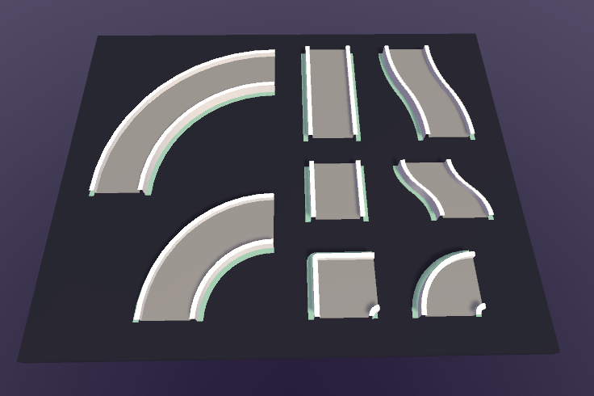
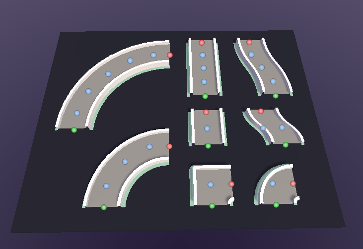
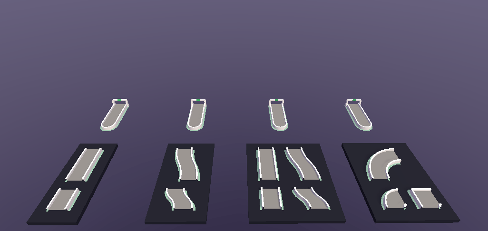
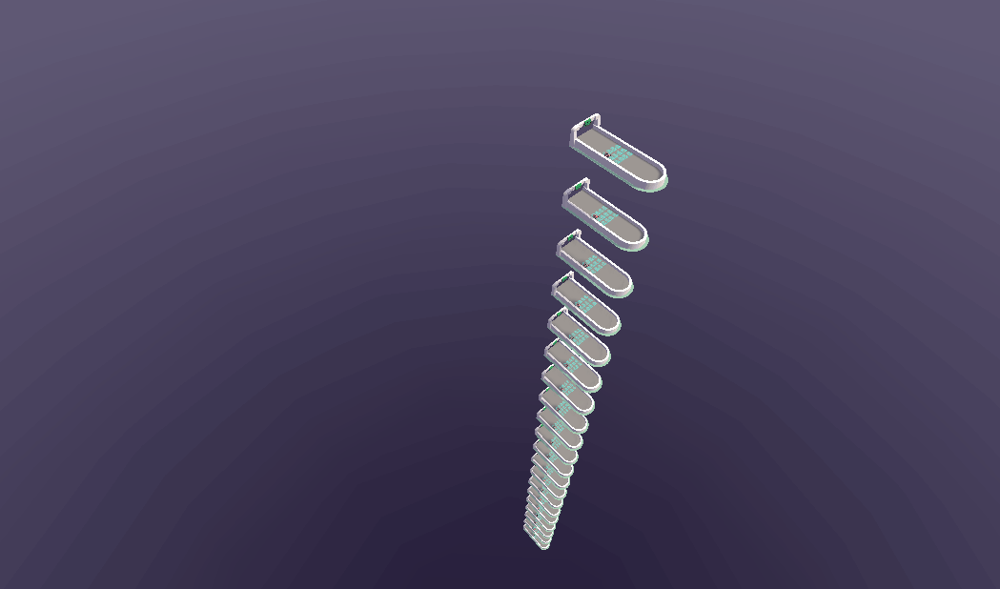
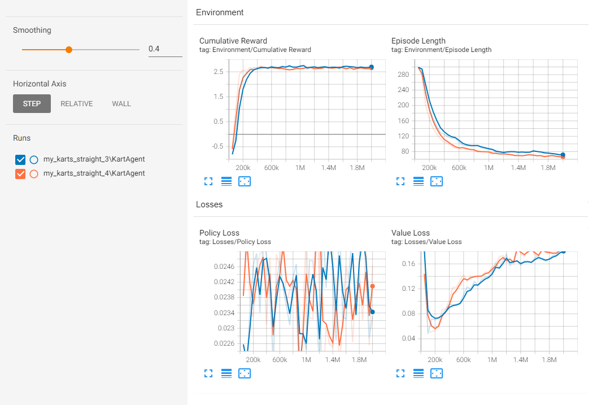
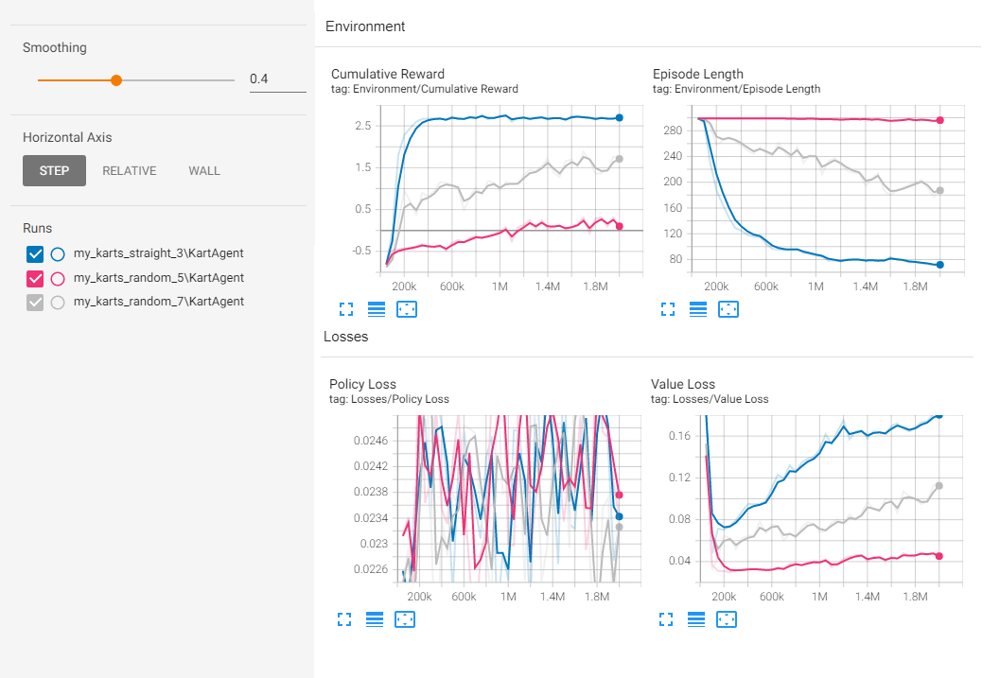
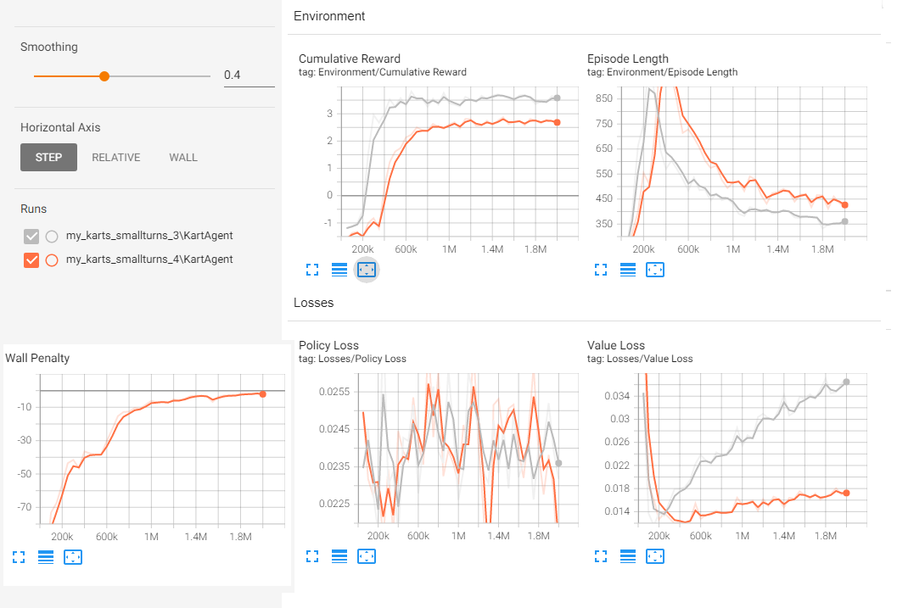

## Abstract
For my project I wanted Unity's ML Agents package in order to train models to drive a simple car through a race course using deep reinforcement learning

## Problem Statement
I'd like to use Unity's ML Agents package in order to train a model that is capable of navigating a randomly generated road effectively. In the process of training this agent, I intend to experiement with how various changes to the training environement and rewards/penalties affect the trained model.

I had two main goals:
-I wanted to be able to vary the track during training in order to compare how it affected train time and agent behaviors
-I wanted to be vary hyperparameters and aspects of the agent’s model structure and rewards to draw comparisons

## Related work
Since I was unfamiliar with the ML Agents framework, I ended up going over lots of different walkthough tutorials showing how to use it. Links to videos and articles that I referenced are in README.md

## Methodology
### Part 1: Learning to use the framework
The first part of this project involved getting familiar with the ML Agents framework since I had never used it before. To do this, I went through various tutorials and followed along with one. Afterwards, I the ending point of that tutorial as a starting point for this project.

### Part 2: Generating random roads for training
One of the aspects that I wanted to experiment with was how the training environment influenced the training process of a model.
To do this, I created a track generator in order to introduce randomness into the training environment with several parameters that I could control. 
Although there isn’t a dataset in the same sense as supervised learning, the generated tracks serve a similar purpose in the sense that the features of the track infuences how the track learns.

For each of the tiles that I used with the track generator, I had to add nodes to identify the entry and exit points of each tile (shown with green and red dots). Additionally, in order to validate the placement of each track piece I used additional points in the middle of the road surface in to raycast through (shown with blue dots). If a validation raycast of one tile hits the geometry of another, the raycasting tile cannot be placed without overlappling the roadsurface of the other.

 | 
:---:|:---:
Full tileset without nodes visible | Full tileset with nodes visible

After annotating tiles and creating prefabs from them, I was able to instantiate them into the scene the track generator. The generation method is fairly straight forward:
1. Sample a new track piece to extend the current road
2. Validate that placing this piece won't block an existing road
3. Commit to placement and extend the road if valid, otherwise don't place the piece and try again
4. Repeat 1-3 until the road has reached the desired length or the track generated has reached the max number of placement iterations for the current road
5. Place checkpoints along the track and a decorative finish line at the end of the road

This generation works fairly well and allows for some flexibility. The total number of tiles in a generated track can be varied in order to make the course longer or shorter. The tiles that the generated track samples from can also be changed in order to alter the types of features that can be generated. Checkpoints for the agent are placed at the borders between tiles and the end of the course in order to track progress through it and trigger additional actions in response to reaching a checkpoint, such as adding a reward or extending the agent's time limit. Additionally, particularly large pieces can be counted as multiple tiles when placed in order to make the length of the navigatable road surface from varying as much.

 | 
:---:|:---:
These generators create tracks with 5 tiles, 10 tiles, and 40 tiles | These generators use 5 tiles in their track, but each sample from a different pool of tiles

After getting the track generator working reliably, the next step was to incorporate it into the training process of the model. Adding an agent from the tutorial that I followed was enough to begin training, but in order to train multiple agents in parallel I had to make a prefab of this trainable environment and duplicate it multiple times. In order to avoid one track generator interfering with or otherwise influencing the generation of another (ie. blocking the path and forcing it to turn), I stack the duplicates vertically on top of one another.

:---:
This shows 20 environments running in parallel. The agents on each are all evaluating using the same model

### Part 3: Experimenting with traning models
After creating a generator, I varied aspects of the generation to observe how agents trained:
- Tilesets (What track pieces are sampled to randomize the tracks)
  - only straight pieces
  - only small curved pieces
  - only curved pieces
  - all tiles
- Track Length (How many tiles are in the track)
- Timer + bonus time for reaching a checkpoint (How much time does the agent have to complete the track)
- How often the track is regenerated (measured in number of episodes completed using it)

Additionally, I varied aspects of the reward functions
- Penalty each step (to encourage higher speed)
- Penalty when hitting a wall (to encourage obstacle avoidance)
- Reward for reaching checkpoints
- Reward for completing the track

Notably, I trained most of my models for about 2,000,000 steps (~30 minutes each).

## Experimenting
#### Partial Reward between checkpoints (with fixed time)
Although the original code included a reward for reaching each checkpoint, I wanted to add a fraction of the checkpoint reward for moving towards it without reaching it completely
This was implemented by calculating the percentage of the euclidean distance away from the next checkpoint and mapping that value to between the max reward and zero.
Could be adjusted to additionally add a penalty for moving backwards away from a checkpoint that has been reached

I expected that adding this reward to existing rewards would improve performance since the euclidean distance heuristic is consistent given that checkpoints are placed at the border of each tile. To verify this, I trained two models with the same hyperparameters other than the partial reward for checkpoints:

#### Tileset Subsets
For this test, I wanted to compare how the features of tiles in the tileset could influence how the model trained. I expected that straight tiles would be the easiest to navigate than turns, and that subsets of the full tileset would be easier to learn on.
- *my_karts_straight_3* trained with only straight tiles (4 total)
- *my_karts_random_5* trained with all 8 tiles
- *my_karts_random_7* trained with only the small turn tiles (2 total)

On a similar note, if more tiles were to be added it would also be interesting to see how the size/length of a tile influenced training since that affects how far apart checkpoints are placed.

#### Time Bonus for checkpoints 
For this test I wanted to compare how the training process would differ if the time limit was reset on reaching a checkpoint against the time limit being constant.
Note that although both had a small penalty per frame, the fixed time limit made it so that the total penalty from this was constant regardless of progress.

I wasn’t sure which would lead to better results so I wanted to do a direct comparison with and without the time limit bonus. For this test, I used only the small turn tiles as a compromise between the simplicity of only straight tiles and the complexity of using all the tiles.
- *my_karts_random_7* used a penalty of -0.0001 per frame and 30 second fixed time limit
- *my_karts_smallturns_2* used a penalty of -0.001 per frame and 20 second time limit that was refreshed upon hitting a checkpoint
- 

#### Track Length
For this test, I varied the length of the track in order to investigate whether there is a significant difference in the training process
Wall Penalty
For this test, I wanted to compare how having a penalty for hitting a wall would affect how the model trained and how the corresponding agent would drive. This was motivated by the observation that before making the car’s steering more responsive, agents trained to control seemed to hit and drive along the wall a lot. I tested having no penalty against having a penalty of -0.1 per second of contact.

#### Wall Penalty
For this test, I wanted to compare how having a penalty for hitting wall would affect models during training. 
- *my_karts_smallturns_3* was trained without a wall penalty
- *my_karts_smallturns_4* was trained with a wall penalty of -0.1 per second of contact

#### Network Hidden Layers
After training a lot of models, I was interested in observing changes in the number and size of hidden layers. The other models were trained with 2 layers with 256 units, so I tried varying the number of layers to be 1, 2, and 4 in one test, and the number of units to be 256, 32, and 4

Notably, the time to train the models didn’t seem to change significantly given the change in network structure despite the number of parameters changing. I think this is because the time used for the physics timesteps bottlenecked the training speed, so I’d be interested in formally investigating whether increasing the time scale or adding more training environments to the training scene would change the training speed or other observable features in the training process.

## Observations
Here are some of my observations:
- Training with all of the pieces and/or with longer tracks slowed down the training when there was a fixed time. Having time be granted after each successive checkpoint significanly improved this though.
- Policy loss graphs for most of my sessions were very noisy, but the agent was still performing well. I'd guess that this is because the value was fairly small from the start, and that the control space was simple enough to learn fairly quickly.\
- Although most of my models were 2 layers with size 256, it seemed that reducing layers to 1 actually increased performance. i'd figure this is becasuse input and output sizes are small in comparison.

## Demo *(maybe)*

## Extensions
If I were to continue this project, I’d be interested in a few areas:
- Experiment more with types of observations passed to the model
  - Change the number and position of raycasts
  - Give more pose data about checkpoints and physics data about self
  - Try image observations collected from a camera on the front bumper
- Creating and incorporating more track tiles in order to create more varied tracks and challenging obstacles
  - For example: varying the width of the road, adding changes in elevation, or creating hazards that reduce speed or end the training episode
- Making competitive agents that can collide with one another when driving on the same track
  - Maybe more complex behaviors like passing / blocking could arise, especially if some sort of drafting mechanic is included
- Attempting to tune handling for the car based on the performance of agents as they train with it
  - Can adjust acceleration, top speed, and steering responsiveness and compare on different types of tracks/tilesets
  - Possibly create and train another model to adjust these parameters, either to help or hinder the agent driving
- Implement a variety of car controllers to train models with. The controller used here is very arcady in it’s calculations, but more complex calculations can also be introduced to change how the controller handles
  - Per-wheel suspension and weight shifting
  - Lateral wheel friction and slip curves
  - Reduced steering response at high speed
