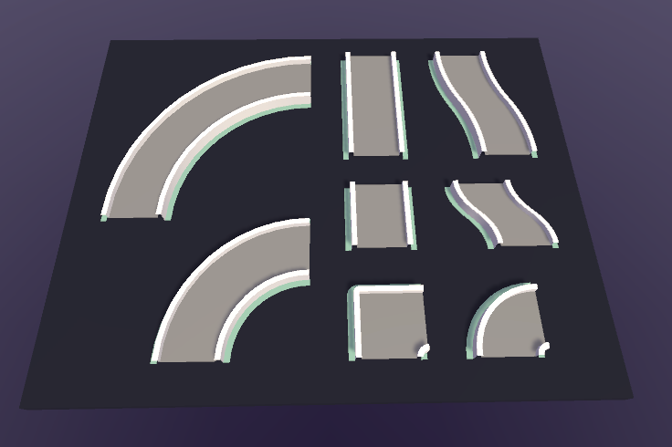
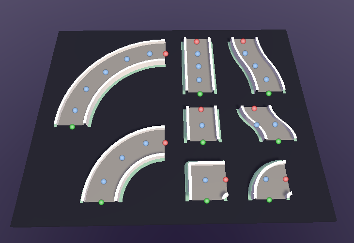
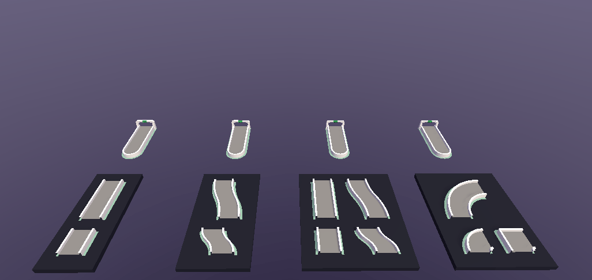
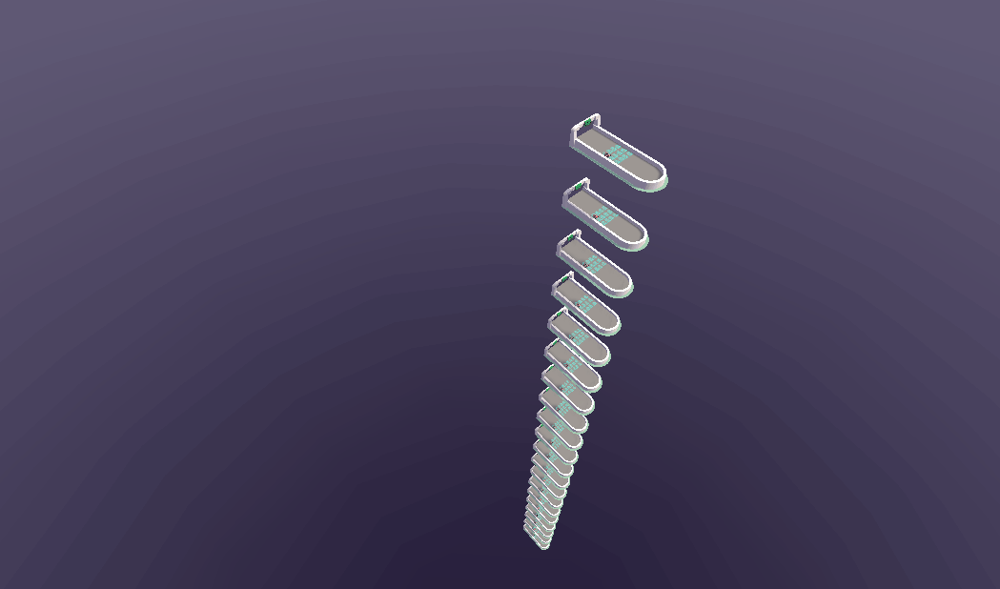
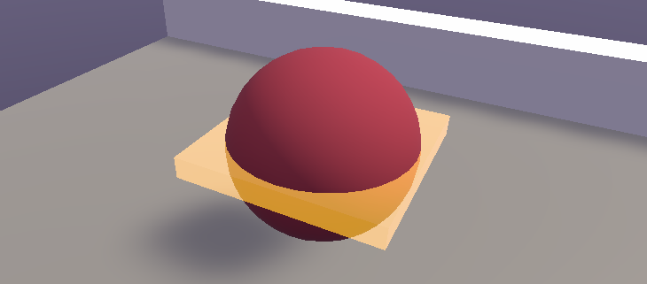
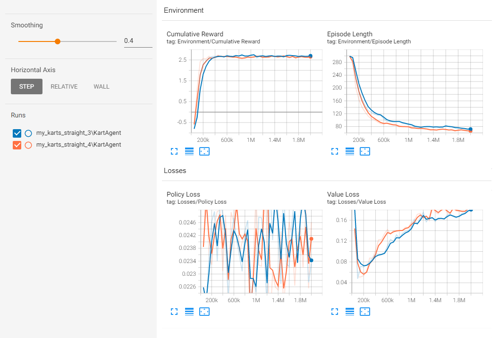
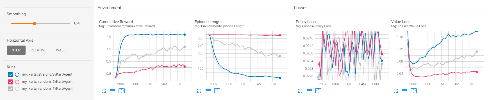
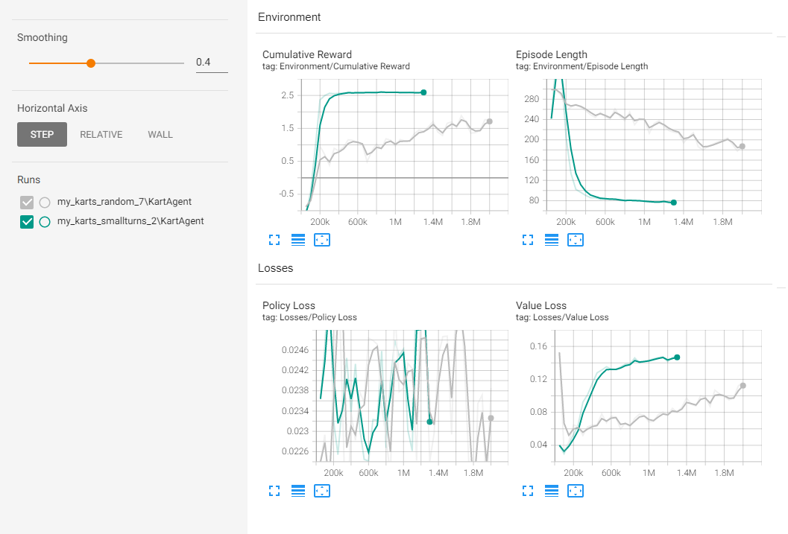
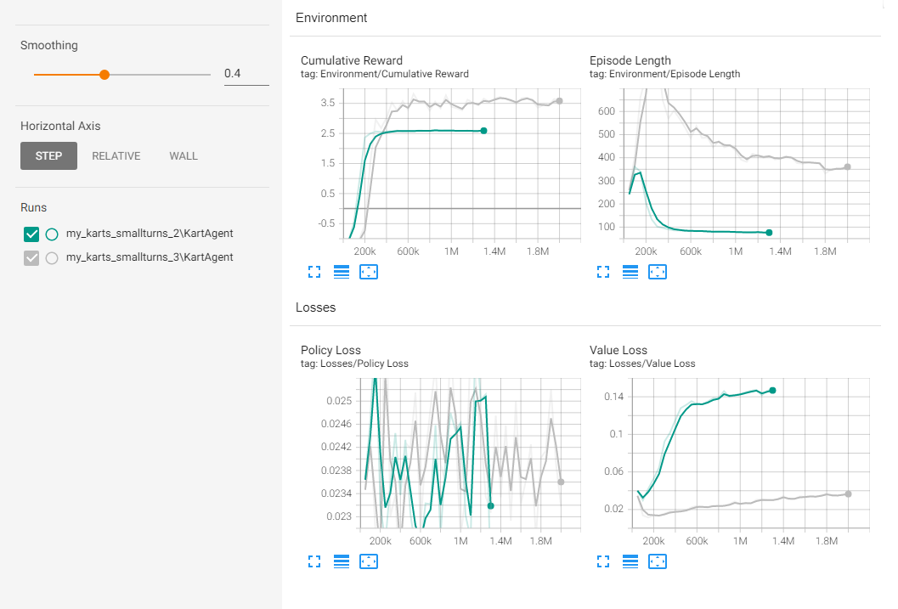
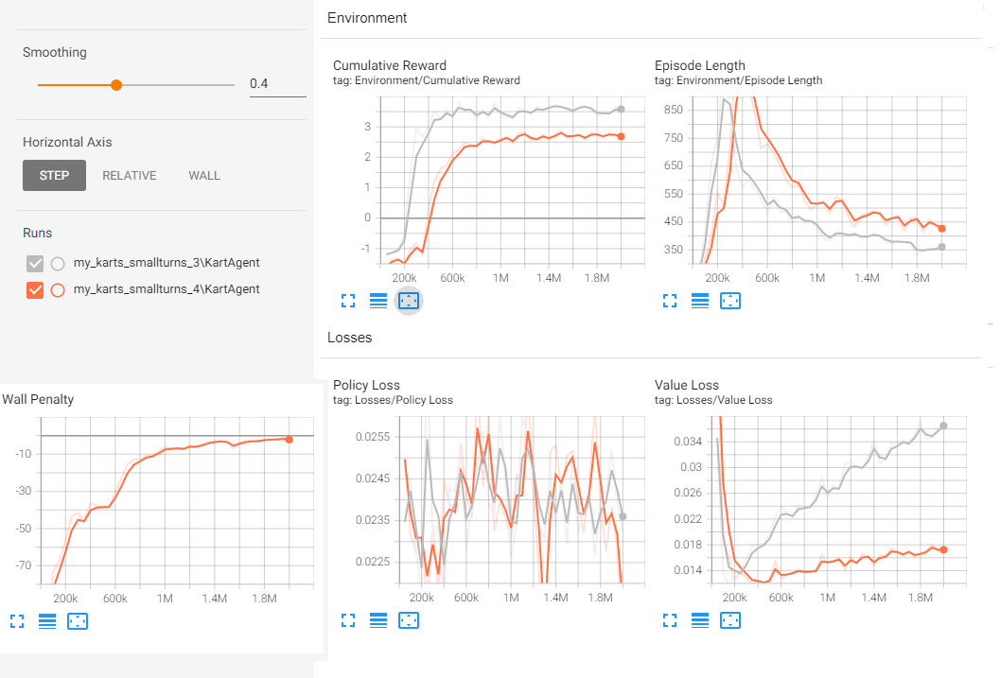

In this project, I went through the process of learning and applying Unity's ML Agents package in order to train a model capable of driving a car on tracks that it has not seen before. After completing a tutorial to get started, I expanded on it by implementing a reward for failing close to the next checkpoint along the track, a penalty for touching the wall of the track, and a track generator in order to produce a variety of track configurations by sampling from a tileset randomly. After this, I trained lots of models in order to experiment with various parameters relating to rewards and environment so that I could observe changes in the training process and draw comparisons.

#### Video Presentation Link: [https://youtu.be/IEEw3OSF4iA](https://youtu.be/IEEw3OSF4iA)
#### Repo Link: [https://github.com/TStrong85/599G1-Project](https://github.com/TStrong85/599G1-Project)

## Problem Statement
I wanted to use Unity's ML Agents package in order to train a model that was capable of navigating a randomly generated road effectively. In the process of training this agent, I wanted to experiment with how various changes to the training environment and rewards/penalties affect the trained model. Particularly, I had two main goals:
- Try varying the tracks the agent trained on in order to compare how it affected train time and agent behaviors
- Try varying hyperparameters and other aspects of how the agent’s model learned in order to draw comparisons. This could include changes to the structure as well as changes to rewards and penalties.

## Related work
Since I was unfamiliar with the ML Agents framework, I ended up going over lots of different walkthrough tutorials showing how to use it.

Links to some of the videos that I referenced while working on the project:
- [ML-Agents 1.0+ Creating a Mario Kart like AI](https://youtu.be/n5rY9ffqryU)
- [ML-Agents 1.0+  Create your own A.I.  Full Walkthrough  Unity3D](https://youtu.be/2Js4KiDwiyU)
- [How to use Machine Learning AI in Unity! (ML-Agents)](https://youtu.be/zPFU30tbyKs)
- [AI Learns to Drive a Car! (ML-Agents in Unity)](https://youtu.be/2X5m_nDBvS4)
- [Creating a Game with Learning AI in Unity! (Tutorial / Machine Learning)](https://youtu.be/gYwWolRFt98)
- [Mario Kart's Drifting  Mix and Jam](https://youtu.be/Ki-tWT50cEQ)

Links to some of the articles that I referenced while working on the project:
- [An Introduction to Unity ML-Agents](https://towardsdatascience.com/an-introduction-to-unity-ml-agents-6238452fcf4c)
- [Diving deeper into Unity-ML Agents](https://towardsdatascience.com/diving-deeper-into-unity-ml-agents-e1667f869dc3)

And lastly the ML Agents Github Repository had lots of helpful resources and documentation:
- [Link to ML Agents repo](https://github.com/Unity-Technologies/ml-agents)
- [Reference paper about ML Agents](https://arxiv.org/abs/1809.02627)

## Methodology
### Part 1: Learning to use the framework
The first part of this project involved getting familiar with the ML Agents framework since I had never used it before. To do this, I went through various tutorials and followed along with one. Afterwards, I used the ending point of that tutorial as a starting point for this project. [Here is the particular tutorial that I followed at this stage](https://youtu.be/n5rY9ffqryU) and [the associated repo](https://github.com/Sebastian-Schuchmann/AI-Racing-Karts).

In addition to this, the [ML Agents Github repo](https://github.com/Unity-Technologies/ml-agents) had a number of example scenes and training environments available to download and use.

### Part 2: Generating random roads for training
One of the aspects that I wanted to experiment with was how the training environment influenced the training process of a model.
To do this, I created a track generator in order to introduce randomness into the training environment with several parameters that I could control. 
Although there isn’t a dataset in the same sense as supervised learning, the generated tracks serve a similar purpose in the sense that the features of the track influences how the track learns.

For each of the tiles that I used with the track generator, I had to add nodes to identify the entry and exit points of each tile (shown with green and red dots). Additionally, in order to validate the placement of each track piece I used additional points in the middle of the road surface to raycast through (shown with blue dots). If a validation raycast of one tile hits the geometry of another, the ray casting tile cannot be placed without overlapping the road surface of the other.

 | 
:---:|:---:
Full tileset without nodes visible | Full tileset with nodes visible

After annotating tiles and creating prefabs from them, I was able to instantiate them into the scene of the track generator. The generation method is fairly straightforward:
1. Sample a new track piece to extend the current road
2. Validate that placing this piece won't block an existing road
3. Commit to placement and extend the road if valid, otherwise don't place the piece and try again
4. Repeat 1-3 until the road has reached the desired length or the track generated has reached the max number of placement iterations for the current road
5. Place checkpoints along the track and a decorative finish line at the end of the road

This generation works fairly well and allows for some flexibility. The total number of tiles in a generated track can be varied in order to make the course longer or shorter. The tiles that the generated track samples from can also be changed in order to alter the types of features that can be generated. Checkpoints for the agent are placed at the borders between tiles and the end of the course in order to track progress through it and trigger additional actions in response to reaching a checkpoint, such as adding a reward or extending the agent's time limit. Additionally, particularly large pieces can be counted as multiple tiles when placed in order to make the length of the navigable road surface vary less.

 | 
:---:|:---:
These generators create tracks with 5 tiles, 10 tiles, and 40 tiles | These generators use 5 tiles in their track, but each sample from a different pool of tiles

After getting the track generator working reliably, the next step was to incorporate it into the training process of the model. Adding an agent from the tutorial that I followed was enough to begin training, but in order to train multiple agents in parallel I had to make a prefab of this trainable environment and duplicate it multiple times. In order to avoid one track generator interfering with or otherwise influencing the generation of another (ie. blocking the path and forcing it to turn), I stack the duplicates vertically on top of one another.

||
|:---:|
|This shows 20 environments running in parallel. The agents on each are all evaluating using the same model|

### Part 3: Adding additional rewards and penalties
One of the aspects that I wanted to experiment with was how the rewards and penalties used would influence the training process of a model.
Two things that Implemented was a reward for ending an episode closer to the next checkpoint even if the next checkpoint wasn't actually reached, and a penalty for coming into contact with the walls.

For partial checkpoint reward, I used euclidean distance as a heuristic for how much of a reward to give by comparing the distance of the agent from the next checkpoint to the distance from the previous checkpoint to the next checkpoint. The ratio of these distances is used to linearly interpolate between no reward if at the previous checkpoint to the full checkpoint reward if at the next checkpoint. Notably there is no penalty for going backwards along the track, although switching the `Mathf.Lerp()` call to be `Mathf.LerpUnclamped()` would calculate a penalty in this case.

For the wall penalty, I added a trigger collider to the agent in order to detect collisions with the wall and add a small penalty each frame. To do this detection, the road is marked with a "Wall" tag and the trigger follows the car's collider in such a way so that it does not collide with the drivable road surface.

||
|:---:|
|This shows the collision geometry of the kart (the red sphere) and the associated trigger to detect wall collisions (the yellow box)|

### Part 4: Experimenting with parameters
At this point everything that I need is implemented and I can begin experimenting with hyperparameters in order to observe differences in training.

The track generator has two main parameter to mess with:
- Tileset to sample from (stored as a list of tile prefabs)
- Desired length of the generated track (measured as the number of tiles)
- How often the track is regenerated (measured in number of episodes completed using it)

The agent has parameters to determine how rewards are valued
- Initial time limit to reach the next checkpoint & bonus time for reaching a checkpoint (How much time does the agent have to complete the track, and what value the timer set to upon reaching a checkpoint)
- Penalty given each frame
- Wall penalty (measured as value added per second)
- Partial checkpoint reward (a boolean determining whether rewards are given for progress towards a checkpoint)

The agent also has a lot of hyperparameters within `my_training_config.yaml` that control the structure of the model and details like learning rate, gamma, and more. I kept these parameters constant through my experiments for the most part since the tutorial's training config already had decent values, although I did increase the learning rate since the learning rate is configured to anneal over the course of training.

The kart also has parameters that control its speed and handling, but I don't vary them throughout the experiment performed below. For my comparisons, I trained most of my models for about 2,000,000 steps (~30 minutes each) with a few exceptions where the model seemed to converge too early.

## Experiments
### Partial Reward between checkpoints (with fixed time)
For this test I wanted to see if adding the partial checkpoint reward to the model would help it train better, particularly when the time limit was fixed and reaching checkpoints only added a reward without increasing the time limit. I expected that adding this reward alongside existing rewards would improve performance since the euclidean distance heuristic is consistent given that checkpoints are placed at the border of each tile. To verify this, I trained two models with the same hyperparameters other than the partial reward for checkpoints:
- *my_karts_straight_3* had partial checkpoint rewards disabled
- *my_karts_straight_4* had partial checkpoint rewards enabled

Looking at the episode length graph, it seems that the partial checkpoint reward did allow the model to train a bit faster, although the benefit was fairly small. This test occurred with straight track pieces, so maybe adding complexity to the tileset would make the benefit more significant.

### Tileset Subsets
For this test I wanted to compare how the features of tiles in the tileset could influence how the model trained. I expected that straight tiles would be the easiest to navigate than turns, and that subsets of the full tileset would be easier to learn on.
- *my_karts_straight_3* trained with only straight tiles (4 total)
- *my_karts_random_5* trained with all 8 tiles
- *my_karts_random_7* trained with only the small turn tiles (2 total)

Notably these comparisons were made with a fixed time limit. Comparing the graphs, it seems that my expectations were met. The straight tileset optimizes episode length very quickly, the small curves reduce episode length much more steadily, and the full tileset never reaches the point where it is consistently finishing runs and optimizing speed. I think the length of the larger curves may have affected this a bit since both the time limit was fixed, although I tried to reduce the effect of this by counting larger curves as multiple tiles during generation. 

### Time Bonus for checkpoints 
For this test I wanted to compare how the training process would differ if the time limit was reset on reaching a checkpoint against the time limit being fixed.
- *my_karts_random_7* used a penalty of -0.0001 per frame and 30 second fixed time limit
- *my_karts_smallturns_2* used a penalty of -0.001 per frame and 20 second time limit that was refreshed upon hitting a checkpoint

Note that I used only the small turn tiles as a compromise between the simplicity of only straight tiles and the complexity of using all the tiles that was revealed in the previous experiment. Looking at the graphs, using the checkpoint time bonus with a higher penalty per frame had a significant beneficial effect on how fast the model trained. Based on this, it would be interesting to see how using a longer fixed timer or using a shorter refreshing timer would affect training.

### Track Length
For this test I varied the length of the track in order to investigate whether there is a significant difference in the training process.
- *my_karts_smallturns_2* was trained with 5 tile long tracks
- *my_karts_smallturns_3* was trained with 40 tile long tracks

I expected that the episode length would be longer since the tracks would be different physical lengths, but wanted to observe other features. One observation is that the episode length of the shorter tracks converge faster and are not subject to as much noise. I'd guess that this is because it took longer for the agent on the long track to be able to consistently reach the end of the course.

### Wall Penalty
For this test I wanted to compare how having a penalty for hitting a wall would affect models during training. This was motivated by the observation that before making the car’s steering more responsive, agents trained to control seemed to hit and drive along the wall a lot.
- *my_karts_smallturns_3* was trained without a wall penalty
- *my_karts_smallturns_4* was trained with a wall penalty of -0.1 per second of contact

Based on the graphs, the wall penalty caused the model to go slower since the episode length is consistently higher. I'd guess that this is because the penalty discouraged the agent from cutting corners in sharp turns. In addition to the usual plots, I added a graph of the total penalty applied at each section of the training. The magnitude of the units on the vertical axis are large because the values were summed and recorded every ~50k steps, but the shape shows that the wall penalty started high and was reduced to near zero towards the end of the training.

## Conclusion
The various experiments that I performed allowed for some interesting comparisons. The timer method had a significant impact on how quickly the models trained, so it would be interesting to investigate this parameter more. Adding the wall penalty made the model finish the track slower. This shows that there is a trade off between driving clean and driving fast, so it would be interesting to adjust the rewards and penalties to change how this trade off works. Changes to parameters in the track generation also had a significant effect on the models. An interesting general observation was that the policy loss graphs for most of my sessions look very noisy, but the magnitude and range of the values were very low and the agent still performed well. I'd guess that this is because the observations and controls were simple enough to learn fairly quickly.

Overall, I'm happy with the outcome of the project. I was able to alter the reward functions of the agent and observe how these changes altered training and performance, and I was able to vary the training environments of the agents in order to observe different behaviors in different track configurations.

### Extensions
Although I was able to do several different things in this project, there are still a lot more ideas that I could explore relevant to what I've done. If I were to continue this project, I’d be interested in a few areas:
- Experiment more with types of observations passed to the model
  - Change the number and position of raycasts
  - Give more pose data about checkpoints and physics data about self
  - Try image observations collected from a camera on the front bumper
- Creating and incorporating more track tiles in order to create more varied tracks and challenging obstacles
  - For example: varying the width of the road, adding changes in elevation, or creating hazards that reduce speed or end the training episode
- Making competitive agents that can collide with one another when driving on the same track
  - Maybe more complex behaviors like passing / blocking could arise, especially if some sort of drafting mechanic is included
- Attempting to tune handling for the car based on the performance of agents as they train with it
  - Can adjust acceleration, top speed, and steering responsiveness and compare on different types of tracks/tilesets
  - Possibly create and train another model to adjust these parameters, either to help or hinder the agent driving
- Implement a variety of car controllers to train models with. The controller used here is very arcady in it’s calculations, but more complex calculations can also be introduced to change how the controller handles
  - Per-wheel suspension and weight shifting
  - Lateral wheel friction and slip curves
  - Reduced steering response at high speed

